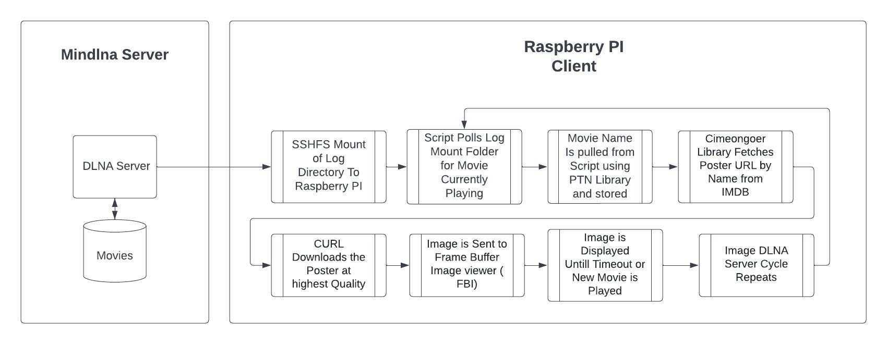
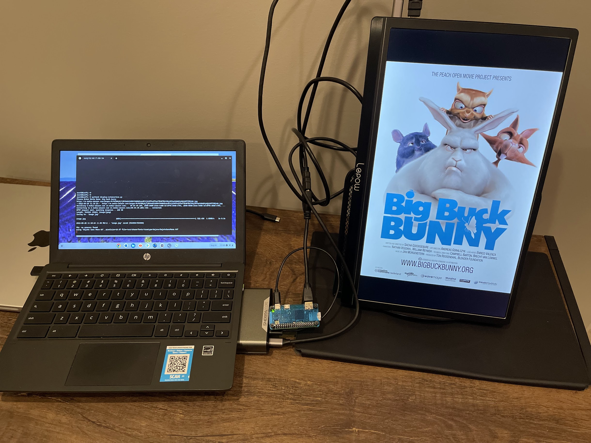

## Description

A script to dynamically download and display movie posters based on “now playing” information pulled from minidlna. The project uses low cost hardware ( raspberry pi zero ) to display posters via HDMI and is intended to be lightweight. A nice touch to a home media room

## Current Status

Protoype script is avaliable. * Looking for Contributors *

## Theory of Operation

A user with video files stored on a nas plays a movie. The current playing movie is displayed on an electronic poster that is hung on a wall. The poster shows whatever's playing. When the movie is changed, the poster automatically updates to the new current movie being played.

## Technical Operation Details 

The Model works in a client-server architecture. The client being the Raspberry PI device, the server any Linux based DLNA server, readymedia or minidlna. A remote mount session is created between the minidlna sever and the client to pull the minidlna log data. When a movie is played through a DLNA request, the script monitors the minidlna.log file for any updates.

The movie file name is fetched from the minidlna log and is parsed using the PTN library on the client device. The movie title name is extracted then fed into imdby/cimeongoer to “search” for the appropriate movie poster. The poster is downloaded and finally , displayed using FBI ( frame buffer ) via raspberry pi CLI.

## Limitations 

- The script will fail unfortunately if no movie name is found. 
- The script is roughly 95% accurate  however sometimes returns the wrong movie. This is a limitation of the the search function unless index selection is implemented. See features needed to be implemented. 
- Because of the limitations of minidlna , there is no API or way to pull data other than log parsing. 
- The log does not provide the current host. If another movie is played on a different device for instance if you have multiple  DLNA clients , the script will overwrite what’s on the screen.

## Hardware requirements

- Raspberry pi (Peferrably Rpi Zero W)
- Dietpi or raspbian light 
- Hdmi display 

## Required Linux software 

 - fbi 
 - Python3
 - Python pip
 - SSHFS 
 

## Required python libraries 

- Pip install 
- Parse-torrent-title 
- IMDbpy
- Cinemongoer

## Instructions 

1. SSH to server running minidlna 
2. Modify the minidlna log level to “info”
3. Restart mini dlna services 
4. Verify log directory location typically /var/log/minidlna 
5. Log into rpi client ( movie poster device )
6. Create directory mount on client device pointing Example: sshfs username@dlna-server:/var/log/minidlna/ /mnt/remote-minidlna/
7. Update the script to include the Path 
8. Run python3 movie-poster. 

## Features to be implemented / Wishlist 

- More accurate parse algorithm
- Easy Install / Pre-req script 
- Better error handling when no movie is found 
- Index selection via GPIO ( Currently picks the first index from cimeongoer , which may or may not be correct )
- Movie timeout ( Changes Poster after x amount of time )

